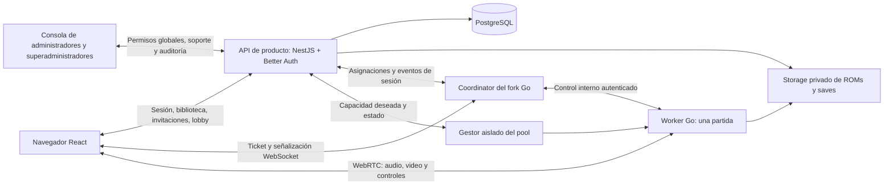

# Plan de implementación de RetroReck

Fecha: 2026-09-19. Base: `cloud-game` en `1fab9ef07a02cab0e0cdea169e95b5ec6e2e04ed`.

## 1. Requisitos confirmados

1. El anfitrión tiene una cuenta y crea una sala con un juego de su biblioteca.
2. Puede invitar directamente a un amigo registrado o compartir un enlace con una persona sin cuenta.
3. El invitado externo entra con un apodo y una identidad temporal, sin formulario de registro ni contraseña.
4. El anfitrión decide qué participante recibe cada control. Puede reservarlo al invitar o asignarlo dentro del lobby.
5. Habrá hasta cuatro puestos de juego, limitados por el juego/core y su configuración.
6. Otros participantes pueden observar sin control. Ser registrado o invitado es independiente de ser jugador o espectador.
7. Los participantes de una partida comparten su worker. El pool crece según partidas y recursos disponibles.
8. Usuarios, contraseñas, recuperación y sesiones se apoyarán en un framework existente.
9. Los administradores gestionan y brindan soporte a la comunidad: consultan usuarios, capacidades y recursos de sus cuentas según sus permisos.
10. Los superadministradores crean y modifican las cuentas administrativas, conceden/retiran permisos y controlan el acceso del equipo.
11. La administración global forma parte de la primera etapa de identidad y del primer lanzamiento; es independiente de ser propietario de un tenant o anfitrión.

## 2. Propuestas de comportamiento para la primera versión

| Situación | Propuesta |
|---|---|
| Invitación a amigo | Invitación interna vinculada al usuario destinatario; aceptación con su sesión |
| Enlace compartible | Sala no listada por defecto; enlace revocable y con vencimiento |
| Entrada sin puesto reservado | Espectador hasta que el anfitrión asigne un control |
| Enlace para reservar un control | Invitación individual de un uso; no compartir una reserva exclusiva con un enlace multiuso |
| Dos invitados reclaman la última plaza | Una operación atómica decide el ganador; el otro puede mirar si hay cupo |
| Teclado o mando físico | Cada participante configura su dispositivo; el anfitrión asigna el puesto virtual del juego |
| Guardado, restauración y reinicio | Solo el anfitrión; progreso asociado al propietario del juego/sala |
| Cierre explícito del anfitrión | Termina la partida y ejecuta el guardado final |
| Pérdida temporal de conexión | Periodo de gracia; se limpian inmediatamente sus botones presionados |
| Host no vuelve | Cierre con guardado después del periodo de gracia, aunque queden espectadores |
| Usuario entra desde dos pestañas | Un solo controlador activo por participante y puesto; la nueva conexión requiere reemplazo explícito |
| Conversión de invitado a cuenta | Vincular identidad de forma verificada; no copiar ROMs ni dar propiedad sobre la partida ajena |

Los límites y tiempos propuestos se detallan en [workers.md](./workers.md). No se implementan transferencias de propiedad del anfitrión ni directorio público de salas en el primer corte.

## 3. Arquitectura propuesta



**API de producto:** identidad, tenant, biblioteca, invitaciones, permisos, lobby, asignación durable, cuotas, metadatos de guardado y auditoría. Recomendación: NestJS con su adaptador Express, Better Auth y PostgreSQL/Prisma; ver [investigación](./identidad.md).

**Consola administrativa:** directorio de usuarios, ficha de cuenta/capacidades/inventario, soporte y operaciones autorizadas. El superadministrador dispone además de gestión del equipo y perfiles de permisos. Las comprobaciones residen en la API; el panel no es una frontera de autorización por sí solo. Ver [administración global](./administracion.md).

**Coordinator:** valida el acceso a la partida asignada, enlaza conexiones, transmite señalización y comandos autorizados, informa estado vivo. Conserva un registro operativo en memoria; no es la única fuente de verdad para propiedad, reservas ni consumo.

**Worker:** ejecuta una partida, valida la autorización de entrada/controles, codifica y envía medios, produce guardados y confirma resultados. No almacena contraseñas ni consulta la base de datos por frame o pulsación.

**Gestor del pool:** crea y retira contenedores con límites de recursos. Se ejecuta separado de la API pública; la API no recibe acceso directo al socket del runtime de contenedores.

**Propiedad del estado:** PostgreSQL conserva identidad, autorización, invitaciones, reservas y asignaciones; el worker es autoridad sobre lo que realmente ejecuta y aplica; heartbeats/eventos reconcilian ambos. El estado deseado y el estado aplicado se distinguen explícitamente.

## 4. Organización de código propuesta

Se preservan `cmd/`, `pkg/`, `web/`, `go.mod` y los builds upstream. Nuevos directorios previstos:

```text
services/platform/             # NestJS: API y módulos de producto
  src/auth/                    # Better Auth y adaptación de sesiones
  src/tenants/                 # Propiedad y aislamiento de datos
  src/staff-access/            # Autoridad global, perfiles y cuentas administrativas
  src/admin/                   # Consultas y operaciones de comunidad autorizadas
  src/support/                 # Ficha de usuario, casos y diagnóstico
  src/library/                 # ROMs privadas, manifiestos y acceso
  src/rooms/                   # Lobby, participantes y capacidades
  src/invitations/             # Usuarios registrados y enlaces externos
  src/assignments/             # Puestos, versiones y confirmaciones
  src/sessions/                # Inicio, cierre y asignación de worker
  src/workers/                 # Registro, leases y conciliación
  src/saves/                   # Metadatos y confirmación durable
  src/usage/                   # Cuotas y consumo idempotente
  src/audit/                   # Acciones de control y diagnóstico
  prisma/                     # Esquema y migraciones
services/provisioner/           # Adaptador del runtime y pool
apps/admin/                    # Consola React del equipo, con módulos de permisos y soporte
contracts/retroreck-v1/         # JSON Schema/OpenAPI, fixtures y eventos
deploy/retroreck/               # Configuración propia, independiente del ejemplo upstream
docs/retroreck/                # Este plan y decisiones
```

Son rutas previstas, no módulos ya creados. El frontend React puede vivir en su repositorio de producto. Los tipos compartidos deben generarse desde contratos verificables, evitando dos definiciones manuales contradictorias en Go y TypeScript.

## 5. Identidad, permisos y controles

El modelo completo está en [identidad.md](./identidad.md), y la autoridad administrativa en [administracion.md](./administracion.md). Un administrador no adquiere permisos globales por ser host o miembro de una organización. Las operaciones administrativas identifican al operador real y al usuario afectado, y se auditan.

Reglas que el motor debe aplicar:

- No inferir permisos a partir de un apodo, código de sala, índice enviado por el navegador o presencia de una sesión autenticada.
- La API verifica el host y emite una orden de asignación con versión, participante, conexión autorizada y puesto.
- Antes de transferir un puesto, el worker bloquea al controlador anterior, limpia botones/ejes/teclas y aplica la nueva versión. Confirma el cambio; la interfaz distingue «pendiente» de «aplicado».
- Procesar reintentos de forma idempotente y rechazar órdenes de versiones anteriores. Solo permitir entrada después de confirmar el permiso actual.
- Un espectador no tiene puerto de control; su conexión puede recibir medios, pero se descartan en servidor todos sus inputs, incluidos teclado y ratón. No simular espectador usando un índice inválido en un array de cuatro puertos.
- Un jugador puede usar su propio teclado como retropad. Para cores con teclado/ratón nativos compartidos, definir quién posee esos dispositivos globales; no asumir cuatro teclados nativos independientes.
- Las órdenes de save/load/reset/grabación requieren capacidades independientes de «puede jugar».
- Validar longitudes, rangos de puerto y límites de frecuencia en la recepción de controles. La asignación pertenece al servidor.

## 6. Contratos a implementar

| Contrato propuesto | Responsabilidad y restricciones |
|---|---|
| Crear sala | Host registrado y verificado; ROM autorizada; crea lobby sin worker |
| Crear invitación | Host; destinatario opcional; modo dirigido o enlace; vencimiento y cupos |
| Canjear invitación | Validación de enlace/usuario, identidad temporal si hace falta, consumo y plaza atómicos |
| Asignar puesto | Host; participante admitido; rango compatible con juego; exclusión y versión |
| Iniciar partida | Host; clave de idempotencia; cuota; reserva exclusiva de worker |
| Ticket de conexión | Participante admitido; audiencia, partida, worker, conexión, vencimiento y generación |
| Cambiar permisos / expulsar | Actualiza versión, revoca tickets y acceso de la conexión viva; no esperar solo al vencimiento |
| Guardado confirmado | ID de operación, versión, hash, ubicación y resultado local/cloud diferenciados |
| Heartbeat / evento interno | Identidad de servicio; asignación/generación; secuencia y deduplicación |
| Cerrar partida | Host o política del servidor; drenar, persistir, liquidar consumo una vez y retirar worker |
| Consultar ficha/inventario de usuario | Administrador autorizado; búsqueda paginada, ámbito y auditoría; sin secretos |
| Suspender usuario / ajustar capacidades | Permiso específico y objetivo ordinario; motivo, auditoría y revocación propagada |
| Crear/editar/desactivar administrador | Solo superadministrador; cuenta verificada, 2FA, revocación y protección del último superadministrador |
| Gestionar perfiles administrativos | Solo superadministrador; capacidades conocidas, versión y efecto sobre sesiones abiertas |

El contrato del motor upstream usa señalización `101`, inicio `104` y DataChannel `data`, negociado con ID 0. Sus controles retropad son binarios. Los códigos internos `201`, `202`, `204`, `205` y `206` ya están ocupados. No reutilizar las tablas del plan antiguo ni añadir extensiones sin negociar versión; `PT` actualmente es `uint8`.

Se propone un canal interno de control RetroReck versionado para admisión, puestos y ciclo de vida, manteniendo inicialmente el formato upstream para medios/retropad. El ticket no fija un permiso irrevocable: las capacidades activas se actualizan y revocan en el worker.

## 7. Etapas y entregables verificables

| Etapa | Trabajo | Criterio de salida | Dependencias |
|---|---|---|---|
| E0 — Baseline | Fork, build reproducible, pin de cores, ejecución con cliente upstream | Una partida con audio/video, dos clientes y save/load comprobado; commit e imagen registrados | Ninguna |
| E1a — Identidad y contratos | Spike Better Auth/NestJS, registro, recuperación, invitado, tenant; fixtures Go/TS | Invitado entra sin registrarse; cuentas aisladas; framework validado, incluido Admin restringido | Independiente de E0 hasta integrar motor |
| E1b — Autoridad administrativa | Administrador/superadministrador, perfiles, bootstrap, 2FA, revocación y auditoría | Superadmin gestiona cuentas/permisos del equipo; admin no escala privilegios; último superadmin protegido | E1a |
| E1c — Consola de comunidad | Directorio/ficha/capacidades, casos de soporte y gestión del equipo | Soporte atiende un usuario con permisos comprobados; un cambio de perfil afecta sesiones abiertas | E1b |
| E2 — Lobby e invitaciones | Usuarios existentes, enlace, revocación, reservas de puestos, cupos | Invitación dirigida no canjeable por otra cuenta; enlace vencido/revocado falla; reserva concurrente correcta | E1a–E1c |
| E3 — Partida privada | ROM autorizada/cache, vista administrativa de biblioteca, worker reservado, ticket y señalización | Cuenta A inicia su juego; B entra solo a la sala; soporte revisa inventario bajo permiso | E0–E2 |
| E4 — Roles en el motor | Puestos exclusivos, cambios en vivo, espectadores, controles del host | Dos jugadores + un espectador; espectador no puede jugar/resetear; transferir control sin botones atascados | E3 |
| E5 — Progreso y reconexión | Save/SRAM, vista de saves, autosave/cierre, reintentos, revocación al motor, gracia y reanudación | Progreso restaurable; errores cloud visibles; suspensión efectiva también en conexión de juego | E3–E4 |
| E6 — Pool y operación | Reposición, cola, límites, conciliación, fallo de worker/Coordinator, TURN y consola operativa | Sin doble asignación; reducción no interrumpe salas; equipo ve confirmación de sus operaciones | E3, E5 |
| E7 — Piloto | Pruebas de administración, juego/navegador, carga y observabilidad | Comunidad administrable, recuperación ensayada y métricas reales de capacidad | E0–E6 |

No se asignan fechas de entrega antes de E0/E1a: toolchain nativa, integración auth y protocolo pueden cambiar la estimación. Cada etapa se divide en PRs pequeños con resultado visible y pruebas de comportamiento. El [roadmap priorizado](./roadmap.md) fija P0 para base/autoridad, P1 para la experiencia completa y P2 para operación/piloto, e incluye el backlog inicial en orden.

### Primeros cambios del fork

| Cambio | Archivos/área del upstream | Prueba que debe acompañarlo |
|---|---|---|
| Ticket y worker autenticados | `pkg/coordinator/hub.go`, `pkg/api/` | Ticket expirado, de otra sala o revocado rechazado |
| Asignación autorizada | `pkg/coordinator/userhandlers.go`, `pkg/worker/coordinatorhandlers.go` | Cliente no puede autoconcederse otro puesto |
| Espectadores y transferencia | `pkg/worker/room/room.go`, input y sesiones | Medios llegan; inputs no se aplican; transferencia limpia estado |
| ROM privada resuelta por ID | `pkg/games/`, inicio de juego del worker | Ruta no arbitraria; hash y propiedad verificados |
| Guardado unificado | `pkg/worker/caged/libretro/cloud.go`, `frontend.go`, `storage.go` | Manual, automático y cierre persisten estado/SRAM de forma consistente |
| Vida de worker y reconciliación | `pkg/worker/worker.go`, Coordinator | Caída de señalización no destruye silenciosamente la partida dentro de la gracia |

## 8. Qué falta y qué cambia respecto del plan anterior

El fork remoto y estos documentos existen. Todo lo demás en E0–E7 queda pendiente salvo el análisis estático y la validación sintáctica del Compose original. No se ha compilado ni jugado en este entorno.

El plan anterior asumía Insforge como elección cerrada y miembros obligatoriamente registrados. Esta propuesta reabre esa decisión, recomienda Better Auth/NestJS y distingue invitados, tenants, roles de sala y autoridad administrativa global. La revisión actual incorpora como requisitos iniciales a administradores y superadministradores con consola de soporte y gestión de permisos. Antes de implementar, reemplazar las tablas antiguas de auth/miembros, protocolo y recuperación; no combinar ambos modelos sin migración explícita.

Las decisiones que el piloto debe resolver son el catálogo inicial de cores, recursos por perfil, cupo de espectadores, presupuesto máximo del pool y plataforma de despliegue. Los valores de laboratorio propuestos permiten empezar sin presentarlos como límites definitivos del producto.
