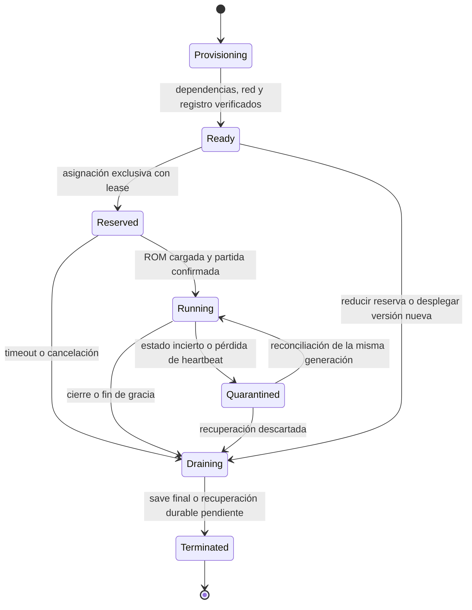

# Pool de workers: asignación, vida y escalado

Fecha: 2026-09-19. Estado: diseño propuesto; el upstream no implementa este pool completo.

## 1. Unidad de capacidad

**Un worker ejecuta una partida activa.** Dos o cuatro jugadores de esa partida comparten emulador y stream codificado; cada peer recibe su transmisión WebRTC. Los espectadores no consumen puestos de control, pero sí conexión, cifrado, ancho de banda y eventualmente TURN.

Un lobby sin partida iniciada solo ocupa datos/presencia del servicio de producto. No reservar CPU de emulación al registrarse, consultar la biblioteca o invitar a alguien. La asignación empieza cuando el host pulsa «Iniciar».

El worker nunca se asigna por cada usuario que entra. Varias salas simultáneas del mismo anfitrión tampoco comparten necesariamente worker: cada partida requiere su propia asignación y debe pasar las cuotas.

## 2. Ciclo de vida



Propuesta inicial: un contenedor/proceso atiende como máximo una partida en su vida útil. Tras cerrarla se retira y se repone capacidad limpia. Las imágenes y cores pueden estar precargados; ROMs privadas y saves temporales usan espacios separados. No reciclar un proceso con estado nativo de otra sala hasta demostrar una limpieza completa.

Un fallo no puede saltar directamente a «libre»: el worker queda excluido de asignación hasta confirmar que su ejecución anterior terminó o fue aislada.

## 3. Flujo de asignación

1. El host solicita iniciar con una clave de idempotencia. La API valida identidad permanente, propiedad de sala/ROM, cuota, concurrencia y estado del lobby.
2. `SessionService` reserva en PostgreSQL una única ejecución para la sala y selecciona un worker `Ready` compatible con región, perfil del core e imagen. Transacción con bloqueo/actualización condicional y unicidad de asignaciones activas; solicitudes repetidas recuperan el mismo resultado.
3. Si no hay capacidad, registrar solicitud pendiente con vencimiento y pedir reposición al gestor. Mostrar «preparando servidor» o cola; no afirmar que existe una reserva todavía.
4. La reserva recibe una generación y lease. La orden de inicio y su evento se conservan con outbox; el Coordinator confirma recepción y el worker valida su asignación antes de cargar.
5. El worker resuelve la ROM autorizada, verifica hash, prepara el guardado y carga el core. Reporta «listo» para esa misma generación.
6. Solo entonces la ejecución pasa a activa y se emiten tickets para sus participantes. Todos conectan al mismo worker; nuevos invitados no provocan otra asignación.
7. Un error de carga vence la reserva, drena ese worker y permite reintentar con una nueva generación. Cancelar durante la cola o reserva también debe reconciliar los recursos ya creados.

**Cambio necesario al upstream:** hoy el Coordinator selecciona worker durante la conexión WebSocket y reserva su slot al iniciar juego. Para RetroReck debe respetar la asignación autorizada de la partida; no dejar dos asignadores independientes compitiendo. Identificadores de worker/sala enviados por el navegador no bastan como autorización.

## 4. Registro y autoridad

Cada worker anuncia identidad de servicio, versión de imagen/core, región, perfil, endpoints ICE y estado de asignación. Un ping HTTP no prueba que el core esté sano: distinguir liveness del proceso, readiness para una nueva partida y salud de la ejecución actual.

El Coordinator envía heartbeats/eventos autenticados a la API con worker, partida, generación y secuencia. La API conserva asignaciones durables y deduplica eventos. El worker aplica comandos solo de su generación activa.

Si el heartbeat vence, poner en cuarentena. **No reasignar la misma partida a otro worker solo porque venció un temporizador.** Primero detener/aislar la ejecución anterior o confirmar pérdida; emitir una nueva generación y rechazar guardados/eventos antiguos. Las escrituras de save deben pasar por un manifiesto/confirmación que también compruebe esa generación.

## 5. Pool y despliegue inicial

Para desarrollo: un host con contenedores y pool pequeño. Un gestor interno con permisos limitados controla el runtime; la API pública solo solicita capacidad mediante una interfaz. Los workers no tienen credenciales de gestión del host ni acceso al socket del runtime.

Una instancia `Ready` solo cuenta como capacidad si puede ejecutar el perfil requerido y anunciar una ruta WebRTC alcanzable. Varios contenedores no pueden publicar el mismo puerto UDP de host: asignar puertos únicos por instancia o IPs independientes; registrar el mapeo correcto para ICE y validar TURN. El Compose upstream de un solo worker no escala sin resolver ese punto.

El despliegue inicial tendrá un máximo fijo y un pequeño margen de servidores preparados, configurable según presupuesto. El gestor repone ese margen cuando se asignan workers y retira exclusivamente los libres al reducir capacidad. No usar un autoscaler basado solo en CPU que pueda terminar partidas activas.

Fórmula conceptual por región/perfil:

```text
ocupados = reserved + running + quarantined + draining
objetivo_total = min(max_workers, ocupados + solicitudes_en_cola + warm_target)
por_crear = max(0, objetivo_total - total_actual_incluyendo_provisioning)
```

Solo contar solicitudes de cola válidas/deduplicadas; mantener histéresis para evitar crear/destruir continuamente. Si `ocupados` supera un nuevo máximo, no matar sesiones para cumplirlo: bloquear nuevas admisiones y drenar al finalizar. Las instancias en cuarentena o drenaje siguen consumiendo capacidad física.

Para una etapa con varios hosts, evaluar **Agones sobre Kubernetes** antes de construir un orquestador distribuido propio. Agones documenta asignación atómica y un buffer de servidores preparados. Su adopción requiere adaptar estados/SDK y red del worker. Si se elige, su asignador será autoridad de capacidad; PostgreSQL conservará la asociación de negocio, sin mantener un segundo pool independiente. Fuentes: [asignación](https://agones.dev/site/docs/reference/gameserverallocation/), [autoscaler](https://agones.dev/site/docs/reference/fleetautoscaler/).

## 6. Parámetros iniciales para el laboratorio

Estos valores permiten probar las políticas; **no son compromisos comerciales ni capacidad medida**.

| Parámetro | Propuesta inicial | Validación |
|---|---|---|
| Salas activas por tenant personal | 1 | Inicio simultáneo desde dos pestañas |
| Puestos de juego | Capacidad validada del juego/core, máximo 4 | Juego de dos puestos nunca admite un tercero |
| Espectadores por sala | 4 | Medir red/CPU; reducir o ampliar después |
| Pool preparado | 1 worker del perfil inicial | Inicio en caliente y reposición |
| Máximo de workers del laboratorio | 2 | Cola y límite efectivos; no usar como dimensionamiento de producción |
| Heartbeat | Cada 5 s; sospechoso tras 20 s | Jitter y pérdida transitoria sin doble asignación |
| Reserva de arranque | 60 s | Medir ROM/cache/core; reconciliar cancelación y timeout |
| Gracia del anfitrión desconectado | 90 s | Retorno al mismo worker o cierre con save |
| Gracia de jugador invitado | 30 s de reserva de su puesto | Inputs limpiados de inmediato; expiración libera el puesto |
| Ticket de conexión | 60 s, un uso | Vencimiento/replay; no limita por sí solo la duración del stream |
| Cierre con subida final | Hasta 30 s antes de estado de recuperación | No descartar el único save local al vencer el tiempo |

La autoridad del host puede reasignar un puesto reservado durante la gracia; al reconectar, el invitado recibe su estado actual, nunca recupera automáticamente un control que ya fue cedido.

## 7. Desconexiones, guardados y cierre

- **Jugador desconectado:** limpiar sus inputs; mantener su puesto solo durante la gracia. No cerrar la partida porque salió un invitado.
- **Espectador desconectado:** retirar su peer; no afecta la emulación.
- **Host desconectado:** iniciar la gracia. Si no vuelve, cerrar la partida; otros participantes no heredan autoridad automáticamente.
- **Coordinator desconectado:** el upstream llama a `Reset()` al reconectar y cierra sala/peers. Hay que cambiar ese flujo para mantener la ejecución durante una gracia acotada y reconciliar asignación/generación antes de aceptar órdenes nuevas. Mientras no exista esa modificación, no anunciar recuperación transparente.
- **Worker perdido:** la memoria de la partida puede perderse; restaurar el último save confirmado en una nueva asignación, después de impedir una ejecución duplicada. Eso es recuperación desde checkpoint, no migración en vivo.
- **Cierre normal:** revocar nuevas entradas, drenar controles, capturar estado/SRAM, subir y confirmar manifest, registrar consumo idempotente y retirar el contenedor.
- **Storage caído al cerrar:** mantener un volumen duradero y trabajo de reintento, o conservar el worker en drenaje dentro del límite operativo. No destruir la única copia tras un timeout ni mostrar «guardado en nube» sin confirmación.

El guardado actual del upstream no basta: autosave/cierre llaman a escritura local y el decorador S3 solo sube el estado principal manual. Se necesita una operación de guardado común con captura consistente, escritura local segura, metadata del core, SRAM/archivos asociados y confirmación cloud.

## 8. Métricas y dimensionamiento

Medir por perfil de core: tiempo de arranque frío/caliente, tiempo hasta primer cuadro, FPS efectivo, CPU, RSS, pausas de codificación, errores, peers, bitrate de salida y proporción TURN. Medir separadamente experiencia del cliente y tiempo de red; ping no equivale a latencia completa de controles a imagen.

Contabilizar duración de ejecución por partida/tenant, no por invitado. Medir también minutos de worker preparado y bytes por peer para conocer costo de operación. Facturación final y límites del producto son decisiones posteriores; evitar doble consumo ante reintentos/eventos repetidos.

Estimación orientativa de red: salida de una sala ≈ bitrate codificado × peers conectados, más overhead; confirmar con métricas y relay TURN. La densidad por host se obtiene del mínimo entre CPU, memoria, red y restricciones de latencia, con margen operativo. No hay aún un número validado de salas por servidor.

## 9. Pruebas de salida

1. Dos hosts solicitan el último worker: solo una reserva tiene éxito; el otro queda en cola.
2. Repetir inicio/cancelación/cierre produce una sola ejecución y una sola contabilización.
3. Entrar con dos jugadores y cuatro espectadores mantiene un único worker; espectadores no pueden enviar acciones al core.
4. Fallo al cargar ROM, reserva vencida y cancelación liberan recursos sin quedar un worker falsamente libre.
5. Reiniciar Coordinator o perder heartbeats no permite doble partida ni autoridad antigua; los eventos atrasados son rechazados.
6. Ceder un control invalida inmediatamente la conexión anterior y limpia su estado.
7. Al cerrar con storage fuera de servicio, el progreso queda recuperable y el estado de sincronización es veraz.
8. Reducir pool o desplegar nueva imagen drena workers libres y deja terminar los ocupados.
9. Varias instancias tienen puertos/ICE correctos; prueba desde redes distintas y con TURN forzado.
10. Los límites de CPU/memoria del contenedor y la limpieza de archivos impiden que una partida contamine la siguiente.
